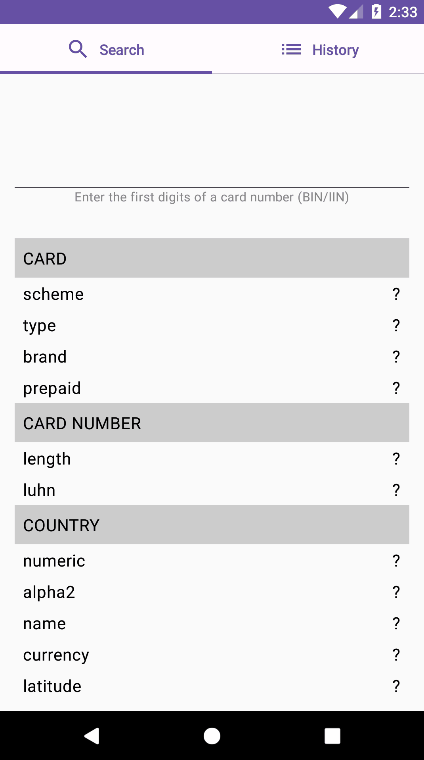
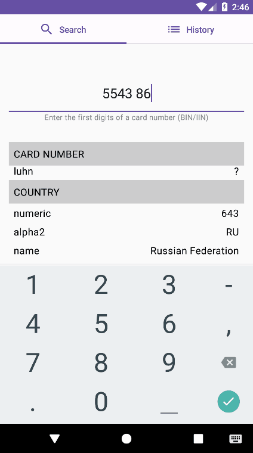
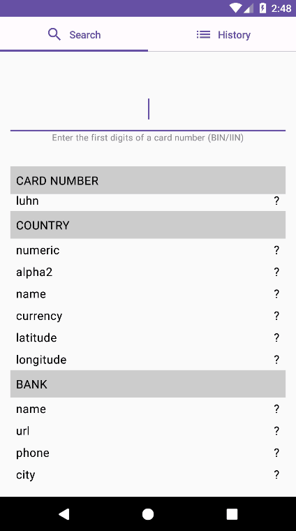
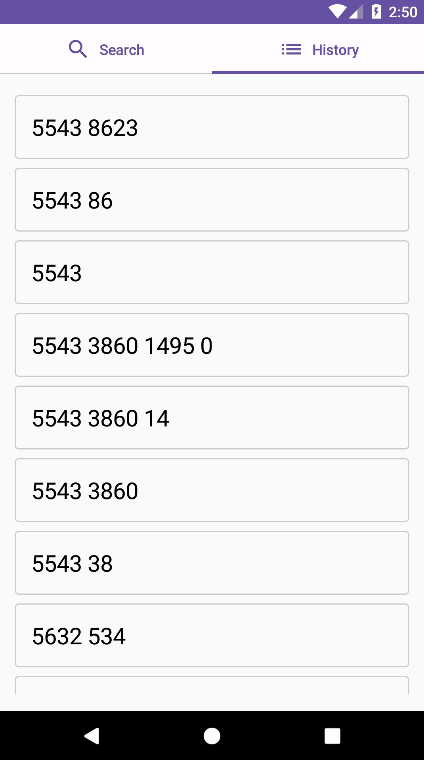
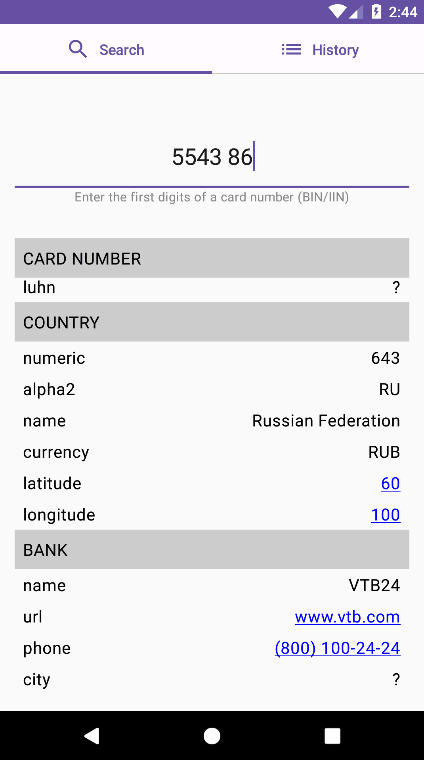

# BIN (Bank Identification Number)
Тестовое задание на вакансию: разработчик мобильных приложений Android (Стажер). 

## Описание задачи
Реализовать Android-приложение со следующими функциями:
1. Пользователь вводит BIN банковской карты и видит всю доступную информацию о нём,
загруженную с https://binlist.net/
2. История предыдущих запросов выводится списком
3. История предыдущих запросов не теряется при перезапуске приложения
4. Нажатие на URL банка, телефон банка, координаты страны отправляет пользователя в
приложение, которое может обработать эти данные (браузер, звонилка, карты)

Первая функция обязательна. Реализованные функции 2-4 будут увеличивать ваш шанс попасть на
курс.
Приложение должно быть реализовано на языке Kotlin. Можно пользоваться любыми
библиотеками, но необходимо объяснить в сопроводительном письме к заданию, почему каждая
из библиотек была вами использована и почему именно эта, а не её аналог.

## Первый запуск приложения

## Загрузка данных карты

## Некорректный ввод

## Сообщения об ошибках

## История запросов

## Браузер

## Звонилка

## Карта

